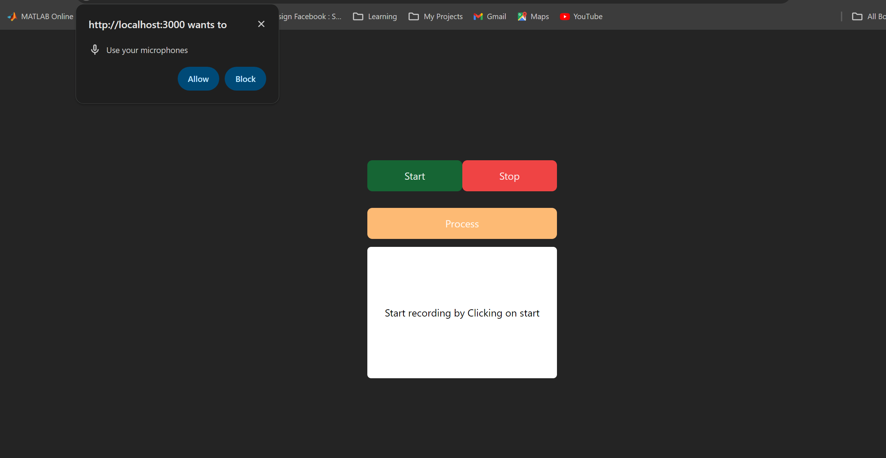
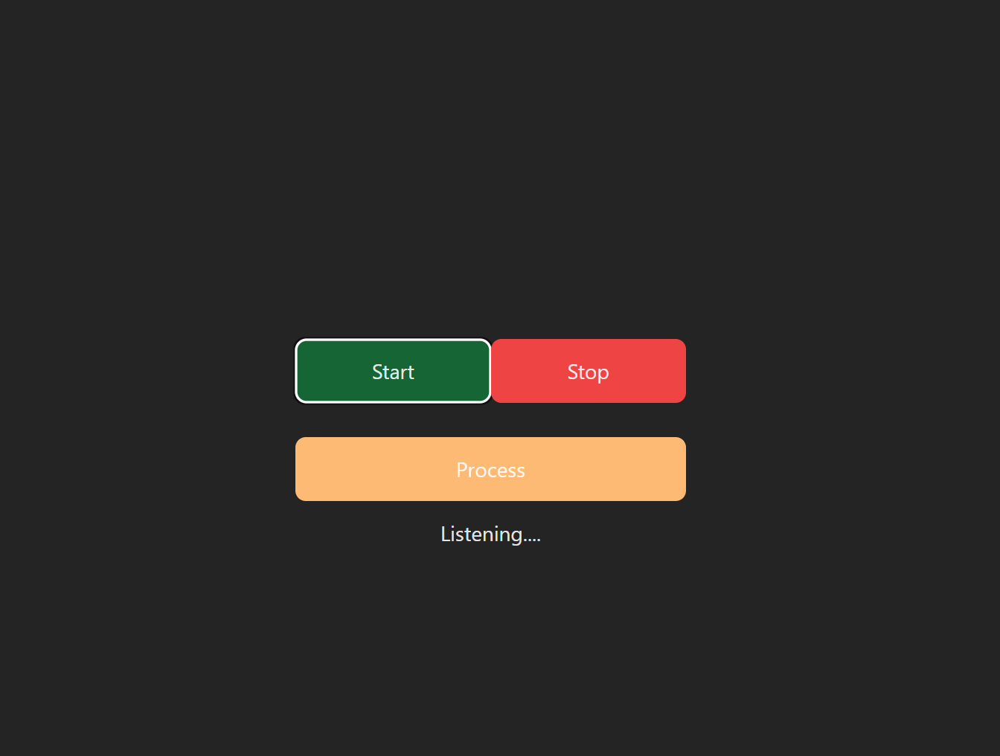
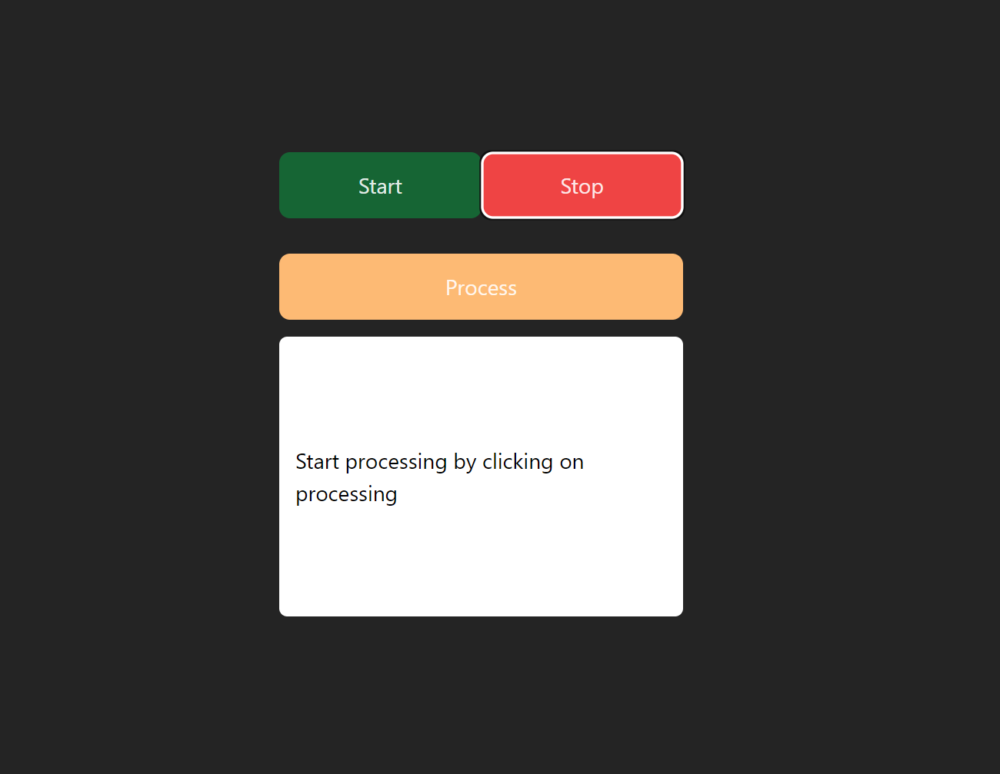
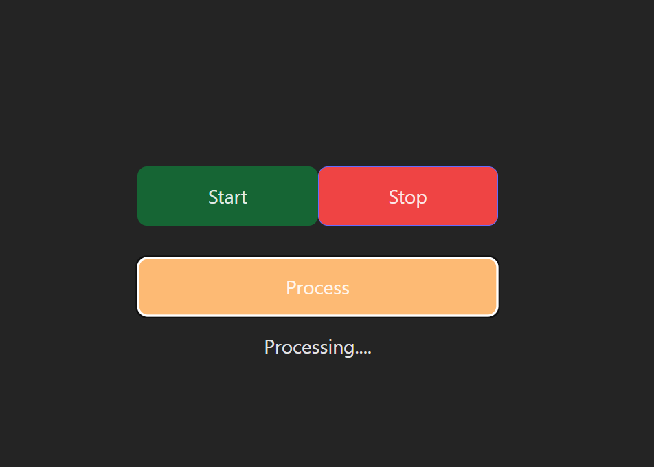
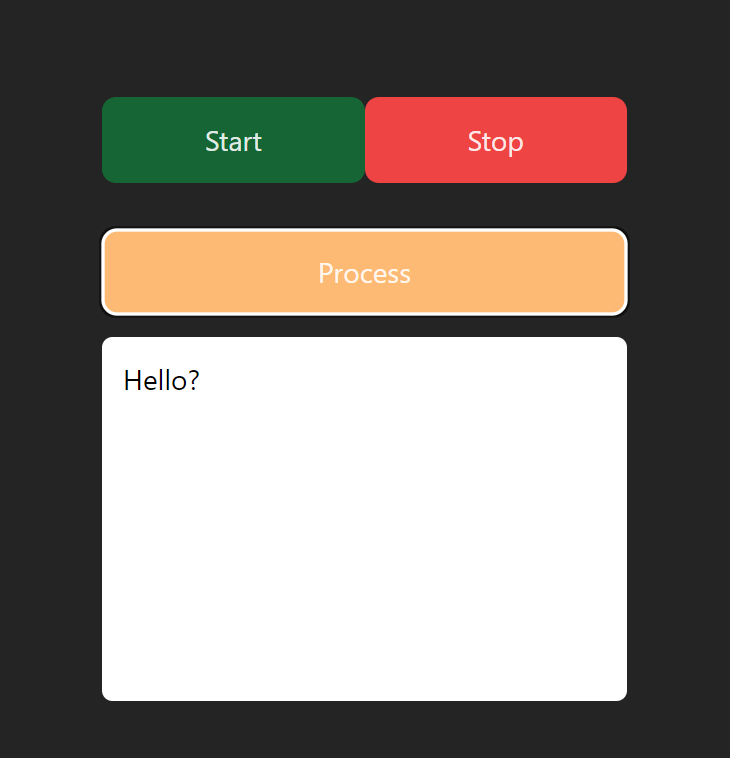

# Speech to Text App

This is a simple speech to text application with a UI to record the audio and API to transcribe the recorded audio

## Setup

### Client

- Go to client folder
- Run `npm install`
- Run `npm run dev`

### Server (On a separated terminal)

- Go to server folder
- Run `npm install`
- Copy the .env.example file content
- Create a new file name with .env and paste the copied values
- Replace --API-HERE-- with your deepgram API key
- Run `npm run dev`

## Workflow with screenshots

On first Load of Application

On Clicking on Start

On stopping of recording

On processing of Recording

After processing is done
